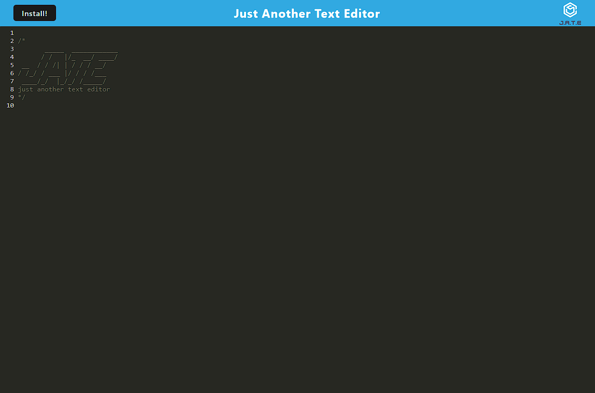

# PWA Text Editor

## Description

This is a PWA in the form of an in-app text editor. The starter code was cloned from the Northwestern Full Stack Development Bootcamp.

In the app, the user will be able to write in the simple text editor that is generated for them. Every time the editor is out of focus, the app will save the content into the IndexedDB using a service worker.

The user can also install the app into their own desktop by clicking the "Install!" button at the top of the page. This will install the app using a manifest.json file.

This is a PWA built with webpack and babel. It was built with a client/server structure. The contents of the client folder will be packed into a 'dist' folder. This is also where the manifest.json is stored.

## Table of Contents

- [Installation](#installation)
- [Usage](#usage)
- [Credits](#credits)
- [License](#license)
- [How to Contribute](#how-to-contribute)
- [Tests](#tests)

## Installation

1. Clone the repo
2. Run 'npm i'
3. Run 'npm run start:dev'
4. Go to 'http://localhost:3000'

## Usage

This project can be used by anyone looking to learn PWA concepts.

## Credits

### Github

[Yoonbacca](https://github.com/Yoonbacca)

### Email

[yoonjaekim3@gmail.com](yoonjaekim3@gmail.com)

## License

None

## How to Contribute

This is a solo project and does not require contributions at this time.
